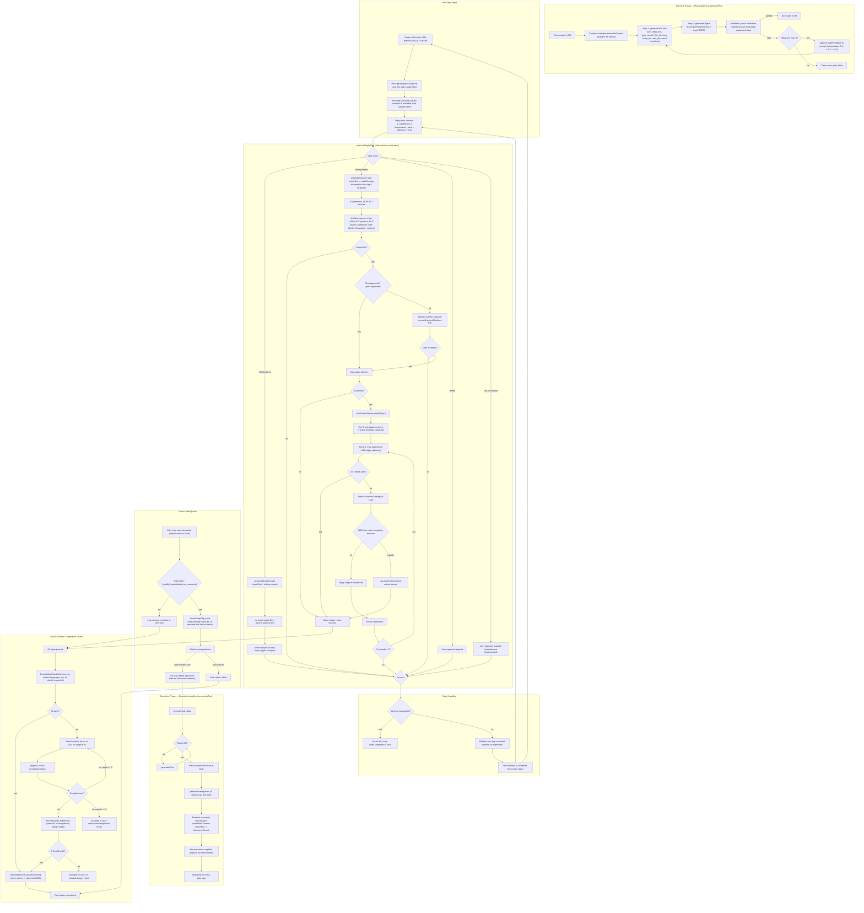

# Execution Flow Diagram

## Verified Architecture Facts

### Planning Phase
| Fact | Source |
|---|---|
| 2-step process: tools exploration → structured JSON | `PlanningService.ts:89-130` |
| Max 5 tool steps | `stepCountIs(5)` at line 153 |
| Temperature escalation: 0.1, 0.1, 0.3 across 3 retries | `attempt === 3 ? 0.3 : 0.1` at line 152 |
| auditPlan validates relative imports only (not absolute/package) | `importPath.startsWith('.')` at line 460 |

### Execution Phase
| Fact | Source |
|---|---|
| Investigation produces raw text, never parsed | `performInvestigation()` returns string, lines 840-842 |
| investText now passed to assembleContext for all steps | `ExecutionLoopService.ts:442, 528` |
| codePlanning blueprint injected per-step for modify/create | `ExecutionLoopService.ts:596-616` |
| 4-fallback parser chain | Lines 584-636 |

### Verification (Advisory)
| Fact | Source |
|---|---|
| Anti-patterns and plan adherence issues are **advisory** — fed back to LLM for fix/explanation, not hard-blocking | `VerificationService.ts:64, 80-84, 92-97` (modified) |
| LLM can explain why a deviation is acceptable and continue | `ExecutionLoopService.ts` (new fix-round logic) |
| tsc removed from per-step verification — moved to post-execution CompilationCheckerService | `DiffVerificationService.ts` (modified) |

### Retry Logic
| Fact | Source |
|---|---|
| Any failed attempt → rollback per-step snapshot → retry (patch-forward removed) | `ExecutionLoopService.ts:251-253` (modified) |
| Fix rounds (max 3) run within the same attempt before rollback | `ExecutionLoopService.ts` (new) |
| maxRetries = 3 preserved for all paths | `ExecutionConfig.maxRetries` default 3 |
| Non-fatal read/analyze failures continue execution | Lines 297-301 |

### DLQ
| Fact | Source |
|---|---|
| User guidance triggers full recursive task restart | `handleStepDlq` lines 762-800 |
| User cancel marks task as failed | Line 790 |

### Post-Execution Compilation Check
| Fact | Source |
|---|---|
| CompilationCheckerService detects project languages (tsconfig.json, Cargo.toml, go.mod, etc.) and runs all checks in parallel | New file |
| Repair loop: max 3 surgical fixes from compiler error, each re-verified | `execution.ts` (modified) |
| After compilation passes, re-verify plan adherence via LLM judge | `VerificationService.runPlanAdherenceCheck()` |
| LearningService runs only after compilation check + plan re-verify pass | `ExecutionLoopService.ts` (modified) |
| Pre-execution snapshot captures ALL filesToModify | Line 161 |
| Per-step snapshot captures only current step's target files | Line 197 |
